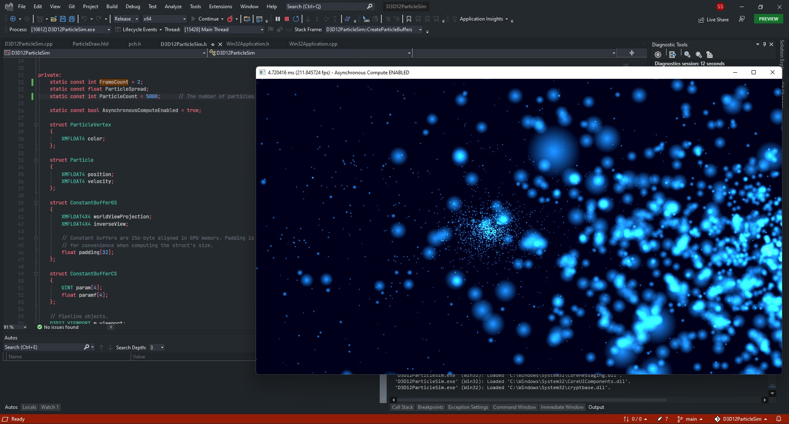

### D3D12ParticleSim
-----
> Absolutely the worst name for reading purposes but it short/tech form for **Direct X 12 Particle Simulations**

This repo is basically an experiment ground for exploring Directx 12 while **trying** to make
*(absolutetly required to say __trying__ )* a n-body simulation of some kind. I haven't explored Dx12
before so it is the perfect chance. I would like to do something similar to a Nvidia Example I tried a while ago
with some kind of adjustment UI

Currently the Controls are : `WASD` for position of camera and `up,down,left,right, arrow`

#### Installation
This project was built on Visual Studio 2022 and the required dependencies like Microsoft Pix are present as
nuget packages which should be easy to setup (Visual studio does it for you most of the times)

Steps :
 - Clone the repo
 - Open the `.sln` or `.vcxproj` file
 - Check that nuget has downloaded pix (you will se erros related to pix if not)
 - Compile in Release mode for x64 or debug

-----

### Logs
-----

 - 22-11-2021 : I have started the boilerplate code for Directx 12 and succeded to make a good old triangle. With little coloring it looks cool for a triangle 😎.
    
    

 - 23-11-2021 : Setup simple texture pipeline now the triangle looks like *Jerry's Home* Door but just 🔵🟦 Blue.
 
    

 - 30-11-2021 : I have been experimenting with the particle system for best performence possible in th fatest way. Current setup is not very performent for large amount of particles (16,000) is the limit for 30fps at my ryzen 5600hbut it works for now.
    The Application now has a basic camera control system with .
    > WASD for position and up,down,left,right arrow for camera angle adjustment.
    
     