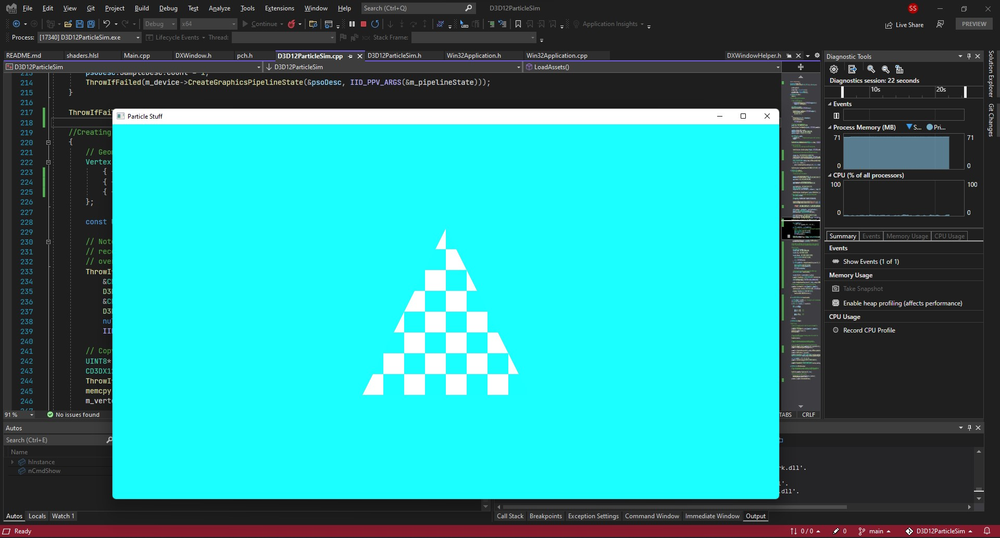

### D3D12ParticleSim
> Absolutely the worst name for reading purposes but it short/tech form for **Direct X 12 Particle Simulations**

This repo is basically an experiment ground for exploring Directx 12 while **trying** to make
*(absolutetly required to say __trying__ )* a n-body simulation of some kind. I haven't explored Dx12
before so it is the perfect chance.

 - 22-11-2021 : I have started the boilerplate code for Directx 12 and succeded to make a good old triangle. With little coloring it looks cool for a triangle 😎.
    
    

 - 23-11-2021 : Setup simple texture pipeline now the triangle looks like *Jerry's Home* Door but just 🔵🟦 Blue.
 
    